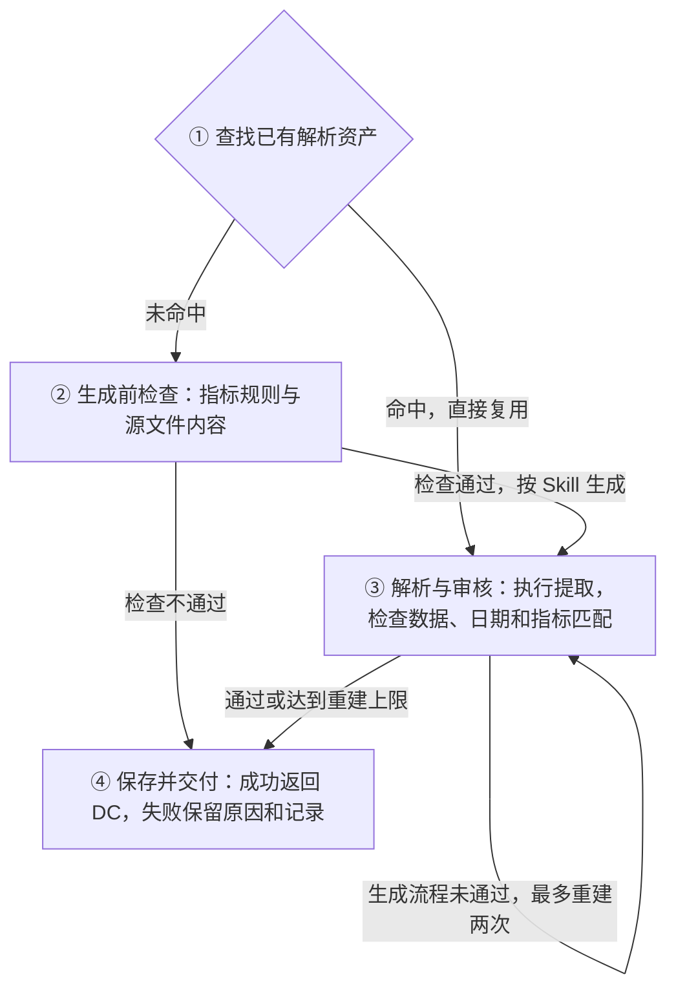

# 外部 Agent 简明流程图

```mermaid
flowchart TD
    A{"① 查找已有解析资产"}
    B["② 生成前检查：指标规则与源文件内容"]
    C["③ 解析与审核：执行提取，检查数据、日期和指标匹配"]
    D["④ 保存并交付：成功返回 DC，失败保留原因和记录"]
    A -->|命中，直接复用| C
    A -->|未命中| B
    B -->|检查通过，按 Skill 生成| C
    B -->|检查不通过| D
    C -->|通过或达到重建上限| D
    C -->|生成流程未通过，最多重建两次| C
```

已有 Python 代码命中后执行本次文件，不重新生成、不进入重建循环；复用 Prompt 后仍调用模型提取。生成流程为初次生成加最多两次重建。规则校验在生成前完成，任何分支都不允许空规则进入有效匹配。失败任务保留记录，不自动重跑。
